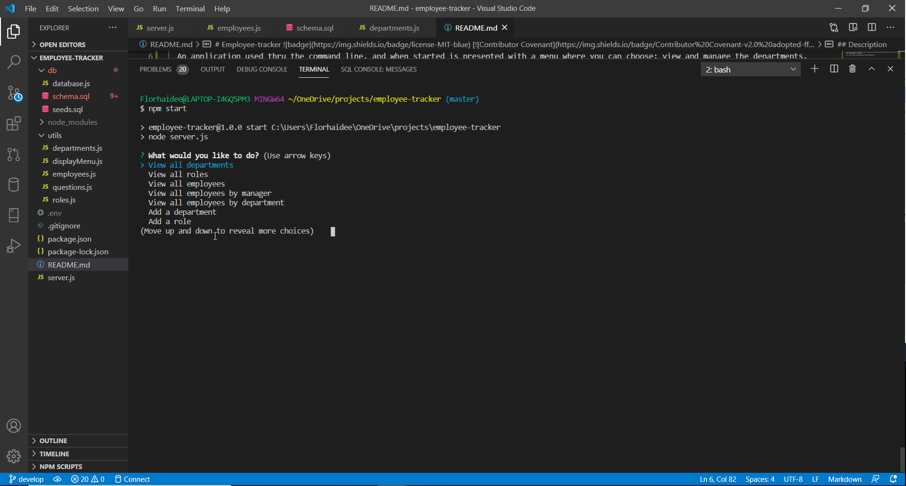
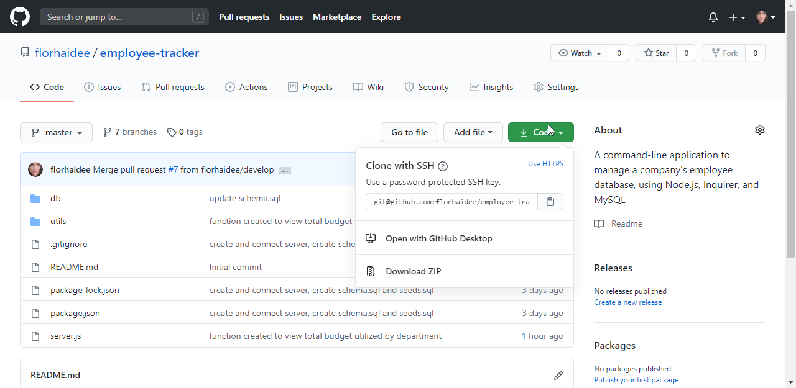

# Employee-tracker  [](code_of_conduct.md)
 A command-line application to manage a company's employee database, using Node.js, Inquirer, and MySQL

  ## Description 

  An application used thru the command line, and when started is presented with a menu where you can choose: view and manage the departments, roles, and employees of a company. 

  

    All menu choices are:
        * View all departments
        * View all roles
        * View all employees
        * View all employees by manager
        * View all employees by department
        * Add a department
        * Add a role
        * Add an employee
        * Update an employee's role
        * Update an employee's manager
        * Delete department
        * Delete role
        * Delete employee
        * View total budget utilized by department
        * Exit


  ## Table of Contents 
  * [Installation](#installation)
  * [Usage](#usage)
  * [License](#license)
  * [Contributing](#contributing)
  * [Questions](#questions)
  


  ## Installation

    1. Download or clone this repository on your computer.

   

    2. To install all dependencies:

        * Open your editor and type the following command into your terminal, once you've navigated to the root directory of the project
        ```
        npm init 
        ```
        * Install all the dependencies using npm
        ```
        npm install -y

        ```
        * Configure MYSQL to create the database;
            Yoy can do it by going to folder 'db/' and file database.js to configure the conection to the database;
            And also on the same folder are the schema.sql and sees.ql files.

  ## Usage

  To know how to use this application, click on the video below.

[]( )


  ## License

    Copyright © 2020 florhaidee. 
    Licensed under the MIT to see more about this license you can find it on the file 'license.txt' go to [MIT-license](./assets/MIT-license.txt) 


  ## Contributing 

    Please note that this project is released with a Contributor Code of Conduct. By participating in this project you agree to abide by its terms.
    Visit [Code of Conduct](https://www.contributor-covenant.org/version/2/0/code_of_conduct/) to have more information.

    To contribute 
     * Add an issue
     * Create a new branch with format-name: 
        - (feature/name/your-name) or (bug/name/your-name) 
     * Make a pull request.


  ## Questions

    If you have more questions about this application, you can contact me by:
      email: florhaideeg@gmail.com
      GitHub username: florhaidee


  ## ©️2020  Made with ❤️ by florhaidee
